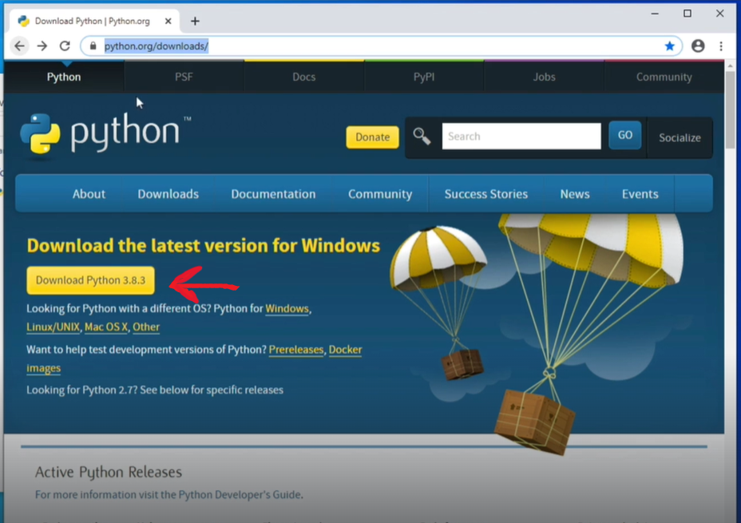
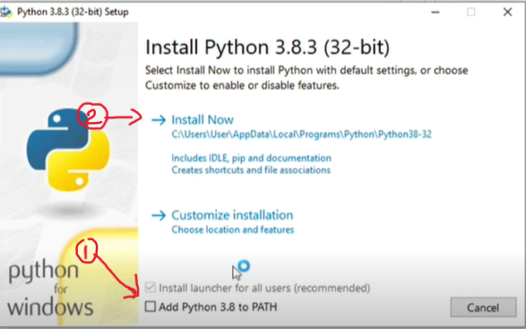
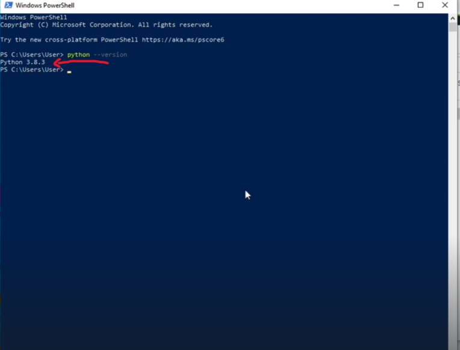
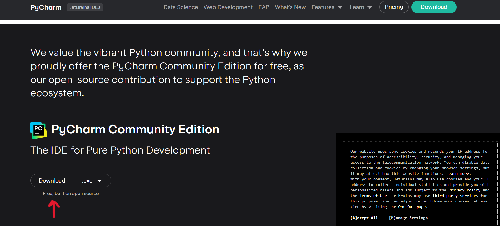

# Python Fundamentals

### Python Installation
Visit the following link: <a href="https://www.python.org/downloads/">https://www.python.org/downloads/</a><br>

1. *Click on the button to download Python:* <br>
<br><br>
2. *Double Click on the new file in the "Downloads" folder* 
3. *Click on "**Add Python to PATH**"*
4. *Click on "**Install Now**"*<br><br> <br><br>
5. *Double Check that installation was succesful through going to a terminal (Powershell, Command prompt, git bash, etc) and type:*<br><br>
`python --version`<br><br>
   1. *If succesful, you'll receive a message with the version of Python installed in your machine*

<br><br><br>

### PyCharm Installation
Visit the following link: <a href="https://www.jetbrains.com/pycharm/download/">https://www.jetbrains.com/pycharm/download/</a><br>
1. Click on "Download".<br>**NOTE: Make sure you select "Community Edition"**<br>

2. Double Click on the new file
3. Follow installation instructions
4. Find application and double click to open it up.

### First Python Project


[//]: # (# Heading)

[//]: # (## Heading 2)

[//]: # (### Heading 3)

[//]: # (#### Heading 4)

[//]: # (*Italic*<br>)

[//]: # (<br>)

[//]: # (**bold**)

[//]: # (## Bullet Points)

[//]: # (- Bullet 1)

[//]: # (- Bullet 2)

[//]: # (- Bullet 3)

[//]: # ()
[//]: # (* Bullet 1)

[//]: # (* Bullet 2)

[//]: # (* Bullet 3)

[//]: # (  * Subbullet1)

[//]: # (  * Subbullet2)

[//]: # ()
[//]: # (1. Step 1)

[//]: # (2. Step 2)

[//]: # (3. Step 3)

[//]: # (   4. Step 3.1)

[//]: # ()
[//]: # (## Code snippets and blocks)

[//]: # (Snippets:)

[//]: # (`code snippet`)

[//]: # ()
[//]: # (You can do this using "\`". Wrap what you want to make it a code snippet like `this`.)

[//]: # ()
[//]: # (Code block:)

[//]: # (```python)

[//]: # (message = "Hello world")

[//]: # (print&#40;message&#41;)

[//]: # (```)

[//]: # (You can create a code block by using three backsticks and putting your code inside those backsticks. For Example:)

[//]: # ("\```"<br>)

[//]: # (Code goes here<br>)

[//]: # ("\```")

[//]: # ()
[//]: # (## Images and lines)

[//]: # (How do you add images and links to markdown)

