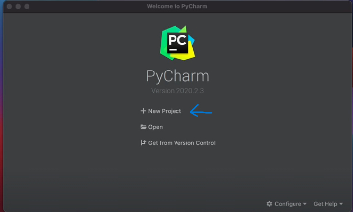
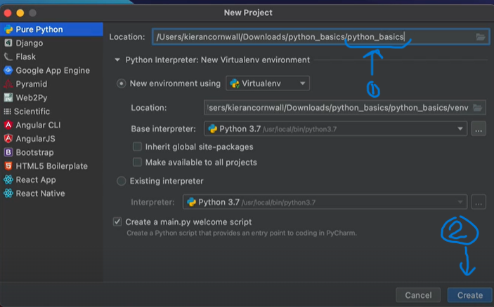
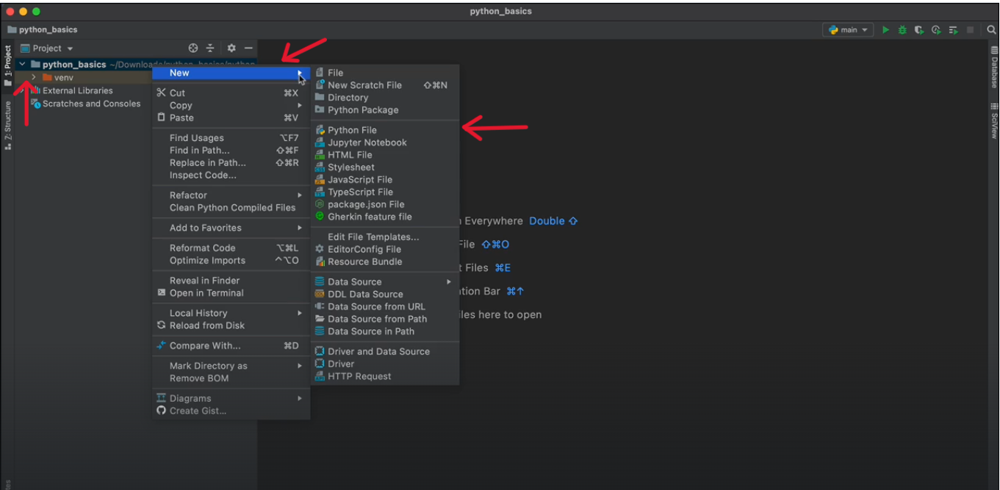
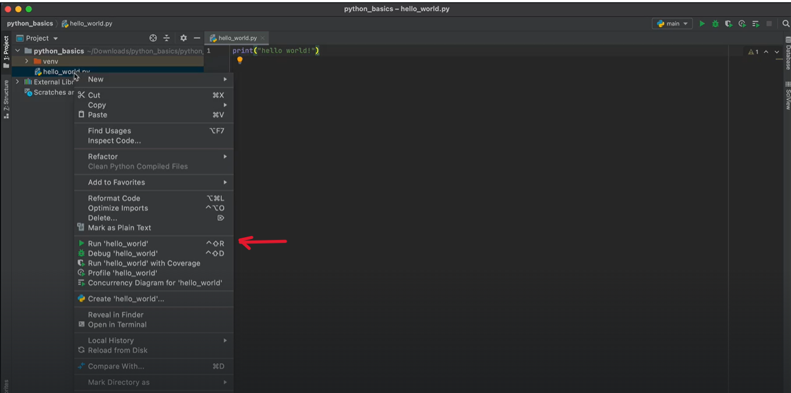

# Python Fundamentals 

### Python Installation
Visit the following link: <a href="https://www.python.org/downloads/">https://www.python.org/downloads/</a><br>

1. *Click on the button to download Python:* <br>
<br><br>
2. *Double Click on the new file in the "Downloads" folder* 
3. *Click on "**Add Python to PATH**"*
4. *Click on "**Install Now**"*<br><br> <br><br>
5. *Double Check that installation was succesful through going to a terminal (Powershell, Command prompt, git bash, etc) and type:*<br><br>
`python --version`<br><br>
   1. *If succesful, you'll receive a message with the version of Python installed in your machine*

<br>

### PyCharm Installation
Visit the following link: <a href="https://www.jetbrains.com/pycharm/download/">https://www.jetbrains.com/pycharm/download/</a><br>
1. Click on "Download".<br>**NOTE: Make sure you select "Community Edition"**<br>

2. Double Click on the new file
3. Follow installation instructions
4. Find application and double click to open it up.

### First Python Project

- Click On "New Project"
- Edit the name of the project if necessary
- Click on "Create"<br>
<br><br>
- Right Click on name of the folder
- Select "New"
- Click on "Python File"<br>
<br>
- Enter the name of the python file (e.g. "hello_world")
  - The extension .py will be automatically provided
- To prove that your environment is running correctly type the following code:<br>
```python
print("Hello World!")
```
- Right Click on the python file name, and then, click on "Run hello_world"<br>
<br>
- If successful, the message `"Hello World!"` will be printed out to the command line.
<br><br>

### Comenting Code
- There are two ways to make comments in Python:
  - Using "#" symbol for one-line comments
  - Using """ """ (triple quoation marks) from multi-line comments
```python
# This is a one-line comment

""" 
This is
a multi-line
comment
"""

# ----- Multi-line comments can also use single quotation marks -> ''' '''----
```

### Data Types
There are various data types. The three main ones are
- **Numbers**
  - Integers (Whole Numbers), i.e. 1, 128
  - Floating point numbers (Decimal Numbers), i.e. 1.2, 45.79
```python
type(5) # int
type(4.8) # float
```
- String (Characters and texts)
```python
type("A") # str
type("I'm also a string") # str
```
- Boolean (Either True or False)
```python
type(True) # bool
type(False) # bool
```
<br>

## Numbers and Math Operators
- ### Addition
The standard mathematical operation to add a number to another. Symbol: `+`
```python
>>>print(5 + 5)
10
>>>print(3.5 + 4)
7.5
```
- ### Subtraction
The standard mathematical operation to subtract one number from another. Symbol: `-`
```python
>>>print(10 - 6)
4
>>>print(5- 7.5)
-2.5
```
- ### Multiplication
The standard mathematical operation to multiply one number by another. Symbol: `*`
```python
>>>print(3*5)
15
>>>print(2.25*4)
9.0
```
- ### Division
The standard mathematical operation to divide one number by another. Symbol: `/`
```python
>>>print(10/5)
2.0
>>>print(1/4)
0.25
```
- ### Modulo
An operation that returns the remainder of a division. Symbol: `%`
```python
>>>print(12%5) # Since 12/5 = (2*5) + 2 (remainder)
2
```


[//]: # (# Heading)

[//]: # (## Heading 2)

[//]: # (### Heading 3)

[//]: # (#### Heading 4)

[//]: # (*Italic*<br>)

[//]: # (<br>)

[//]: # (**bold**)

[//]: # (## Bullet Points)

[//]: # (- Bullet 1)

[//]: # (- Bullet 2)

[//]: # (- Bullet 3)

[//]: # ()
[//]: # (* Bullet 1)

[//]: # (* Bullet 2)

[//]: # (* Bullet 3)

[//]: # (  * Subbullet1)

[//]: # (  * Subbullet2)

[//]: # ()
[//]: # (1. Step 1)

[//]: # (2. Step 2)

[//]: # (3. Step 3)

[//]: # (   4. Step 3.1)

[//]: # ()
[//]: # (## Code snippets and blocks)

[//]: # (Snippets:)

[//]: # (`code snippet`)

[//]: # ()
[//]: # (You can do this using "\`". Wrap what you want to make it a code snippet like `this`.)

[//]: # ()
[//]: # (Code block:)

[//]: # (```python)

[//]: # (message = "Hello world")

[//]: # (print&#40;message&#41;)

[//]: # (```)

[//]: # (You can create a code block by using three backsticks and putting your code inside those backsticks. For Example:)

[//]: # ("\```"<br>)

[//]: # (Code goes here<br>)

[//]: # ("\```")

[//]: # ()
[//]: # (## Images and lines)

[//]: # (How do you add images and links to markdown)

